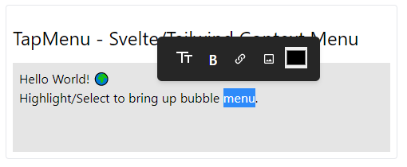

# TapMenu - Tailwind Styled TipTap Menu

Uses [Tiptap](https://tiptap.dev/), [Tailwindcss](https://tailwindcss.com/docs/guides/sveltekit) with [Iconify](https://www.npmjs.com/package/iconify-icon) to make a contet menu.

- [x] [Menu](https://tiptap.dev/)
- [x] [Icons](https://www.npmjs.com/package/iconify-icon)



## Use

As shown in the `./src/routes/+page.svelte` demo code:

```svelte
<script>
	import Tiptap from '$lib/Tiptap.svelte';
</script>

<Tiptap>
	<p>Hello Entry World! 🌍️</p>
</Tiptap>
```
